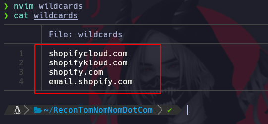
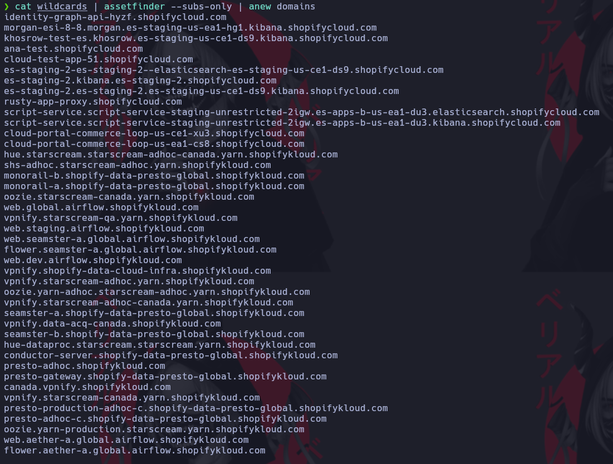
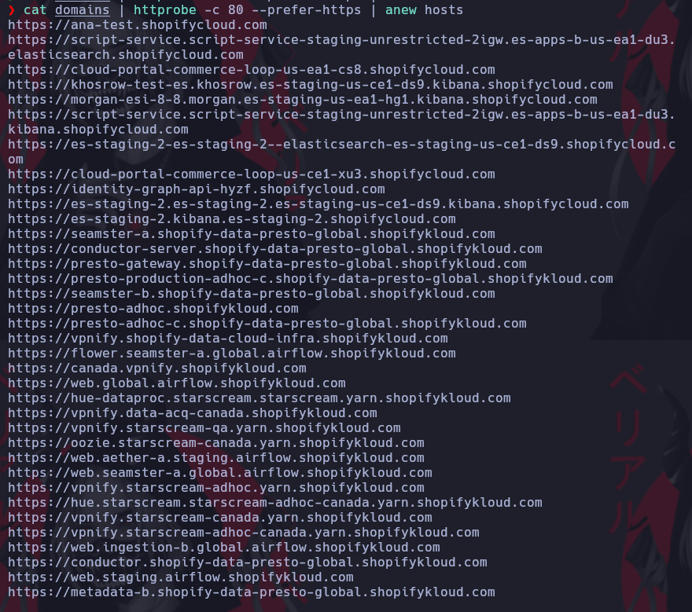
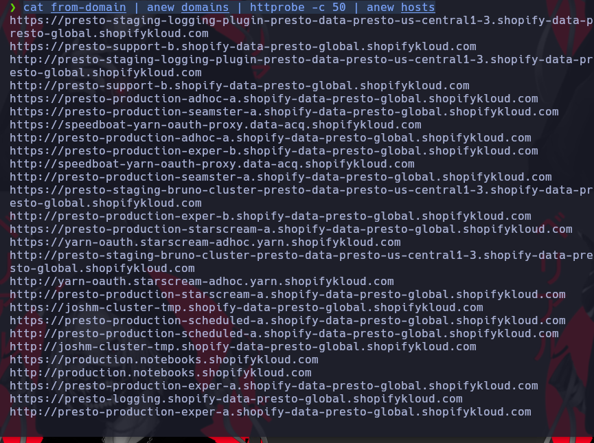

# TomNomNomDotCom

[https://www.youtube.com/watch?v=SYExiynPEKM&t=207s&ab_channel=NahamSec](https://www.youtube.com/watch?v=SYExiynPEKM&t=207s&ab_channel=NahamSec)

Creamos un archivo con todos los dominios para buscarles subdominios



Empezamos a buscar subdominios a partir de la lista de alcance que indicamos arriba\

* assentfinder es la herramienta que busca subdominios
* Herramienta anew junta todo lo encontrado en un solo archivo y quita los duplicados

```ruby
cat wildcards | assetfinder --subs-only | anew domains
```



Ahora vamos a probar cada subdominio encontrado, vamos a probarlo por el puerto 80 y el 443

* Parametro -c puerto 80
* Parametro --prefer-https prueba los que tienen certificado

```ruby
cat domains | httprobe -c 80 --prefer-https | anew hosts
```



Buscamos subdominios con otra herramienta

```ruby
findomain -f wildcards | tee -a finddomain.out
```
Copiamos todos los dominios encontrados de forma manual dentro del archivo **from-domain**


Unimos los dominios encontrados con findomain al archivo domain

```ruby
cat from-domain | anew domains | httprobe -c 50 | anew hosts
``` 



La herramienta fff lo que hace es separar el header y el body de la pagina web 
* Parametro -d 1 delay de 1 segundo
* Parametro -S -o la salida se guardara en una carpeta roots

```ruby
cat hosts | fff -d 1 -S -o roots
```


```ruby

```


