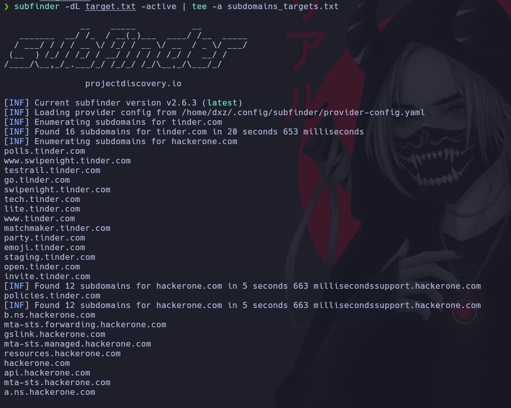

# Subfinder

[https://github.com/projectdiscovery/subfinder](https://github.com/projectdiscovery/subfinder)

# IMPORTANTE: Configurar APIS

Primero debemos configurar las APIs para que la busqueda sea mas exitosa.\
Para listar todas las apis

```ruby
subfinder -ls
```


Debemos configurar las API es la ruta

```ruby
nvim /home/dxz/.config/subfinder/provider-config.yaml
```

## Buscar en un solo dominio

Para correr el programa usamos.
* Parametro -d para el dominio
* Parametro -active busca solo subdominios activos
* | lo exportamos la busqueda en un txt

```ruby
subfinder -d hackerone.com -active | tee -a hackerone.txt
```


## Buscar en varios dominios al mismo tiempo

* Parametro -dL ingresamos la lista de cominios a buscar los subdominios.
* Parametro -es quitar o excluir un motor de busqueda para realizar la busqueda
* Parametro -rl tiempo de espera entre cada peticion

```ruby
subfinder -dL target.txt -active | tee -a subdomains_targets.txt
```




