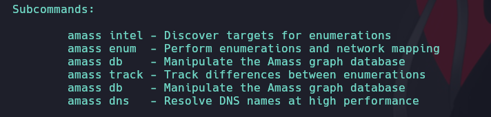
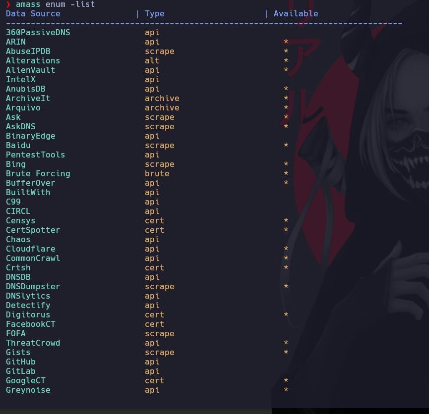

# Amass

[https://github.com/owasp-amass/amass](https://github.com/owasp-amass/amass)


## Instalación 

[https://github.com/owasp-amass/amass/blob/master/doc/install.md](https://github.com/owasp-amass/amass/blob/master/doc/install.md)

```ruby
sudo apt-get install amass
```



## Configurar las APIS

Video demostrativo

[https://www.youtube.com/watch?v=DbjVL-bqfl4&ab_channel=BePractical](https://www.youtube.com/watch?v=DbjVL-bqfl4&ab_channel=BePractical)

Ver las apis configuradas

```ruby
amass unum -list
```



Para configurar este archivo, vamos a google y buscamos.\

[https://github.com/anthrax3/Amass-1/blob/master/examples/config.ini](https://github.com/anthrax3/Amass-1/blob/master/examples/config.ini)

```ruby
amass config.ini github
```

Copiamos el raw en un archivo **config.ini** y empezamos a configurar las APIS

```ruby
nvim ~/.config/amass/config.ini
```

Para ver todas las opciones de la herramienta para enumerar

```ruby
amass enum --help
```

Una vez configuradas las API podremos correr


