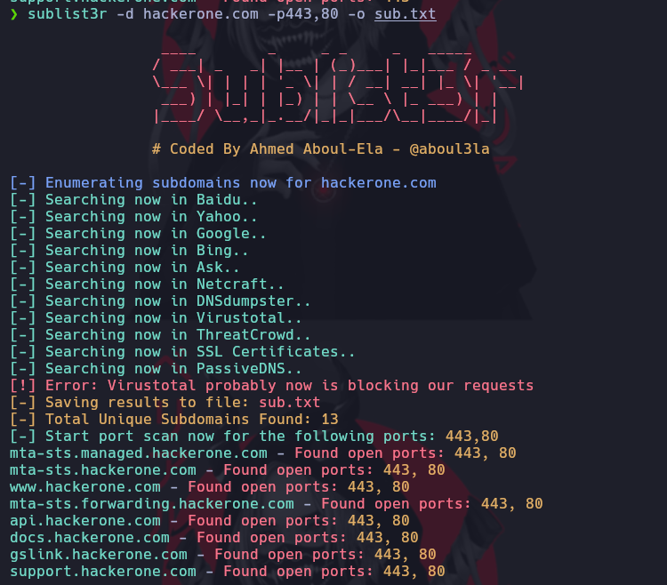

# Sublist3r

[https://github.com/aboul3la/Sublist3r](https://github.com/aboul3la/Sublist3r)

1- Clonamos el repositorio
2- Instalamos los paquetes necesarios

```
sudo pip install -r requirements.txt
```

Copiamos el binario en la ruta **/usr/bin**

Usamos la herramienta de la siguiente forma

* Parametro -d de Dominio
* Parametro -p de puertos
* Parametro -o formato de salida

```ruby
sublist3r -d hackerone.com -p443,80 -o sub.txt
```



