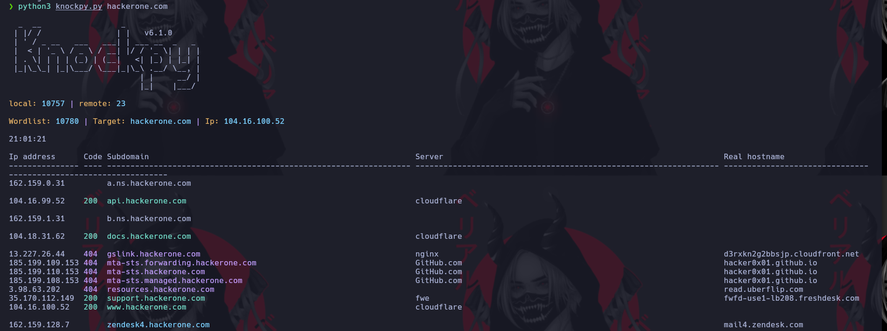

# Knock

[https://github.com/guelfoweb/knock](https://github.com/guelfoweb/knock)

## Instalar

1- Debemos clonar el repositorio
2- Instalar las herramientas requeridas

```ruby
pip3 install -r requirements.txt
```

Copiamos el binario en la ruta **/usr/bin**\
Para poder ejecutar el comando debemos usarlo de la siguiente manera

```ruby
python3 knockpy.py
```



Ese scaneo genera un reporte.\
Para ver el reporte mas organizado usamos.

```ruby
python3 knockpy.py --report knockpy_report/hackerone.com_2023_11_19_21_01_50.json
```


