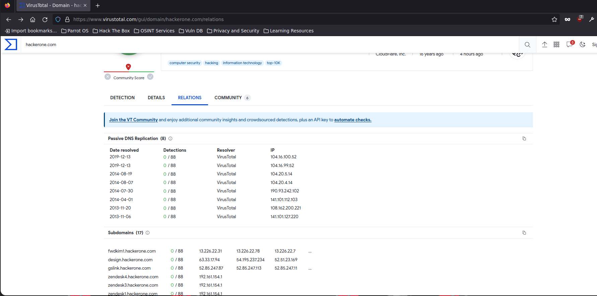

# Virus Total

[https://www.virustotal.com/gui/home/search](https://www.virustotal.com/gui/home/search)

Necesitamos estar logueados

Buscamos el dominio que deseamos buscar los subdomains

Y en la pestaña RELATIONS vemos la información.

Podremos descargar la da la data..
