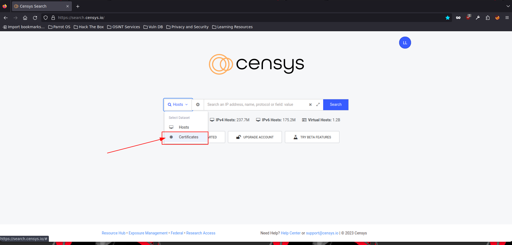
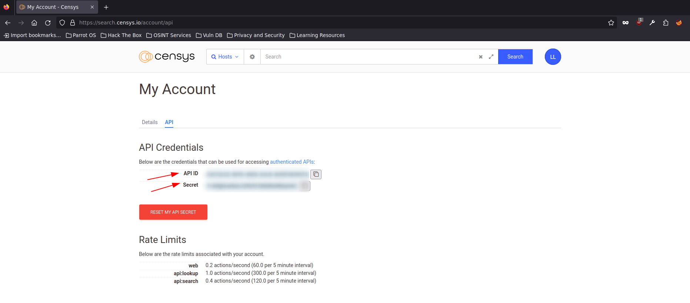
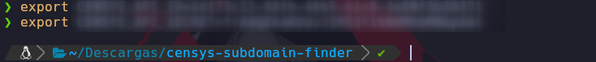
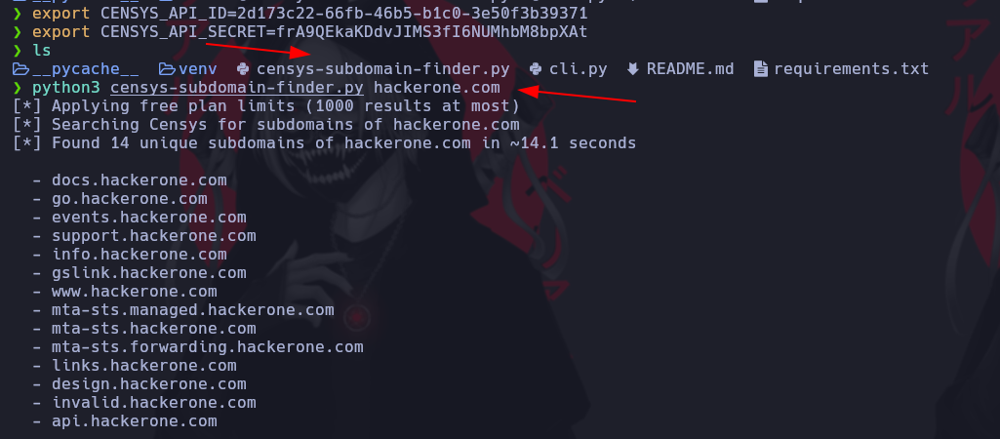

# Censys

[Link Udemy](https://www.udemy.com/course/recon-for-bug-bounty-penetration-testers-ethical-hackers/learn/lecture/35439270#overview)

[https://search.censys.io/](https://search.censys.io/)

Debemos crear una cuenta.

Para buscar debemos seleccionar Certificates despues si, escribir el Dominio



Buscamos la siguiente herramienta para poder extraer los subdominios de Censys

[https://github.com/christophetd/censys-subdomain-finder](https://github.com/christophetd/censys-subdomain-finder)

Relizamos un clone del repositorio.

```ruby
cd censys-subdomain-finder
python3 -m venv venv
source venv/bin/activate
pip install -r requirements.txt
```

Vamos a las API de Censys



Usamos los siguientes comandos y pegamos las API en cada uno de los campos

```ruby
export CENSYS_API_ID=...
export CENSYS_API_SECRET=...
```



Despues de exportadas las APIs procedemos a usar la herramienta de la siguiente manera




