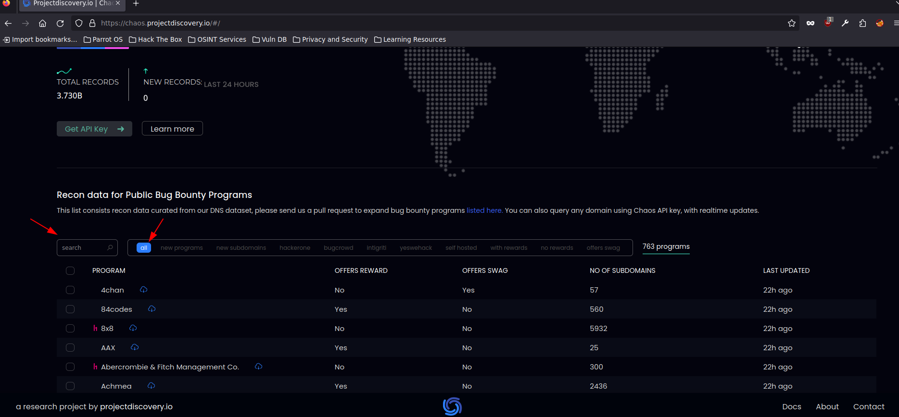
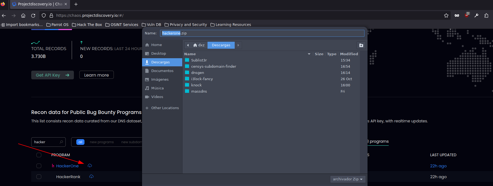
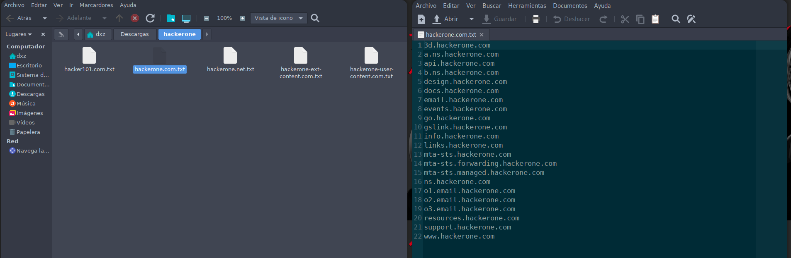

# Chaos Project Discovery

[Link Udemy](https://www.udemy.com/course/recon-for-bug-bounty-penetration-testers-ethical-hackers/learn/lecture/35439404)

[https://chaos.projectdiscovery.io/#/](https://chaos.projectdiscovery.io/#/)

En la siguiente parte buscamos el dominio

Descargamos el contenido y empezamos a buscar

Como podemos ver hay datos que nos interesa

