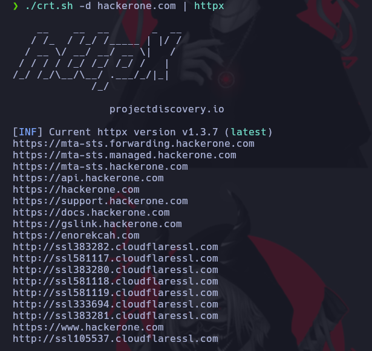

# Crt.sh

[Link Udemy](https://www.udemy.com/course/recon-for-bug-bounty-penetration-testers-ethical-hackers/learn/lecture/35439444#overview)

[https://crt.sh/](https://crt.sh/)

Para trabajar desde linea de comandos

[https://github.com/az7rb/crt.sh](https://github.com/az7rb/crt.sh)

Realizamos un clonde del proyecto entramos a la carpeta y le damos permisos de ejecución.

```ruby
git clone https://github.com/az7rb/crt.sh.git && cd crt.sh/ && chmod +x crt.sh
sudo apt install jq
```

Instalamos Httpx en dado caso que no lo tenga instalado

[Repositorio Httpx](https://github.com/projectdiscovery/httpx)

Instalamos el binario y lo colocamos en el /usr/bin para ser ejecutado

```ruby
httpx -h
```

Para ejecutar el programa usamos 

```ruby
./crt.sh -d hackerone.com | httpx
```




