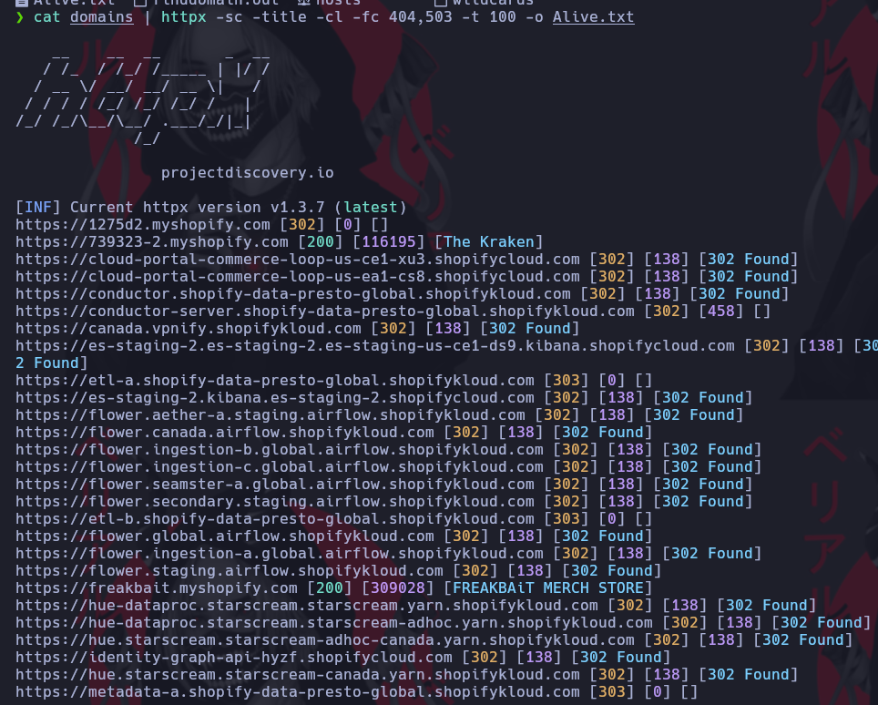

# Httpx

[Link Udemy](https://www.udemy.com/course/recon-for-bug-bounty-penetration-testers-ethical-hackers/learn/lecture/35438808?start=150#overview)

Descargamos el binario le damos permisos de ejecución y procedemos a copiar en /usr/bin

[https://github.com/projectdiscovery/httpx](https://github.com/projectdiscovery/httpx)

Le pasamos el archivo con todos los dominios
* Parametro -sc muestra el codigo de Estado
* Parametro -title muestra el titulo de la pagina
* Parametro -cl muestra el tamaño del contenido en NUMEROS
* Parametro -fc quita los que tengan el codigo que le pasemos
* Parametro -t cantidad de hilos por defecto 50
* Parametro -o Output salida de la herramienta
* Parametro -location muestra a donde esta redirigiendo la pagina
* Parametro -server muestra donde se encuentra almacenada la pagina
* Parametro -td muestra las tecnologias que esta corriendo la web con Wapalayzer
* Parametro -asn trae el numero de ASN de la pagina con la herramienta amass podemos verificar si corresponde al programa que estamos buscando fallos

```ruby
cat domains | httpx -sc -title -cl -fc 404,503 -t 100 -o Alive.txt
```




