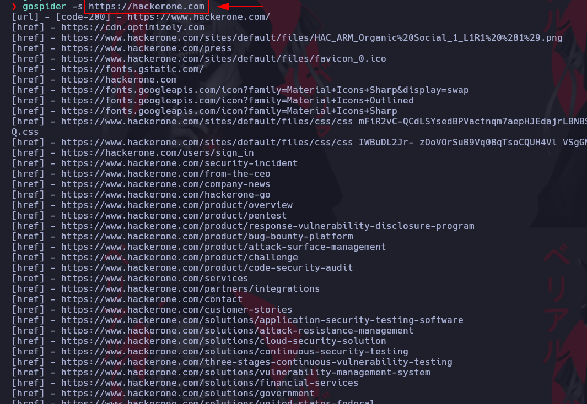

# GoSpyder

[Link Udemy](https://www.udemy.com/course/recon-for-bug-bounty-penetration-testers-ethical-hackers/learn/lecture/35453800#overview)

Herramienta que permite buscar rutas y archivos JS en la URL a buscar.

[https://github.com/jaeles-project/gospider](https://github.com/jaeles-project/gospider)
Hacer un git clone al proyecto y compilarlo con

```ruby
go builder
```

Creamos un archivo con los dominios a buscar con el Spyder


## Importante: colocar Https o Http como corresponda

* Parametro -s escanea solo el dominio que le pasemos
* Parametro -S pasa una lista con los dominiios a buscar
* Parametro -o Output de salida una carpeta
* Parametro -u user-agent es un parametro de la cabecera
* Parametro -H usar cabeceras diferentes
* Parametro -t hilos
* Parametro -k Delay entre cada peticion
* Parametro -K Random delay
* Parametro -w incluir subdominios
* Parametro -v verbose
* Parametro -q no muestra nada en pantalla
* Parametro -l muestra el ancho
* Parametro -R muestra en formato RAW la salida
* Parametro -v verbose
* Parametro -q no muestra nada en pantalla
* Parametro -l muestra el ancho
* Parametro -R muestra en formato RAW la salida




