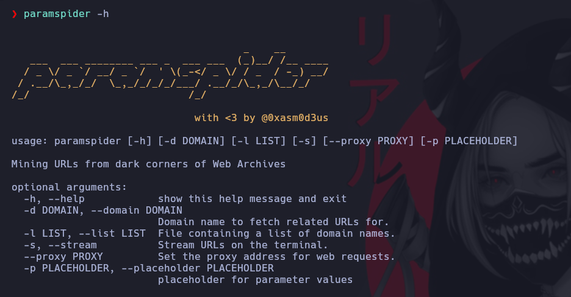

# ParamSpider

Herramienta que busca parametros en URL que posiblemente puedan ser explotados.

[https://github.com/devanshbatham/ParamSpider](https://github.com/devanshbatham/ParamSpider)

Clonamos la herramienta y compilamos el comando de la siguiente forma y pegamosel binario en /usr/bin

```ruby
pip install .
sudo mv /home/dxz/.local/bin/paramspider /usr/bin
```



* Parametro -l le pasamos una lista con los dominios
* Parametro -d le pasamos el dominio
* Parametro --proxy le pasamos la 127.0.0.1:PROXY a usar
