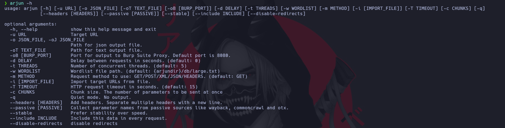

# Arjun


Herramienta que busca parametros para jugar con ellos en la URL y probar si es vulnerable.

## IMPORTANTE
Esta herramienta trabaja con las rutas de URL no directamente con el dominio ejemplo
https://www.hackerone.com/**customer-stories**

[https://github.com/s0md3v/Arjun](https://github.com/s0md3v/Arjun)

Descargamos el archivo e instalamos de la siguiente forma

```ruby
pip3 install arjun
python3 setup.py install
```



