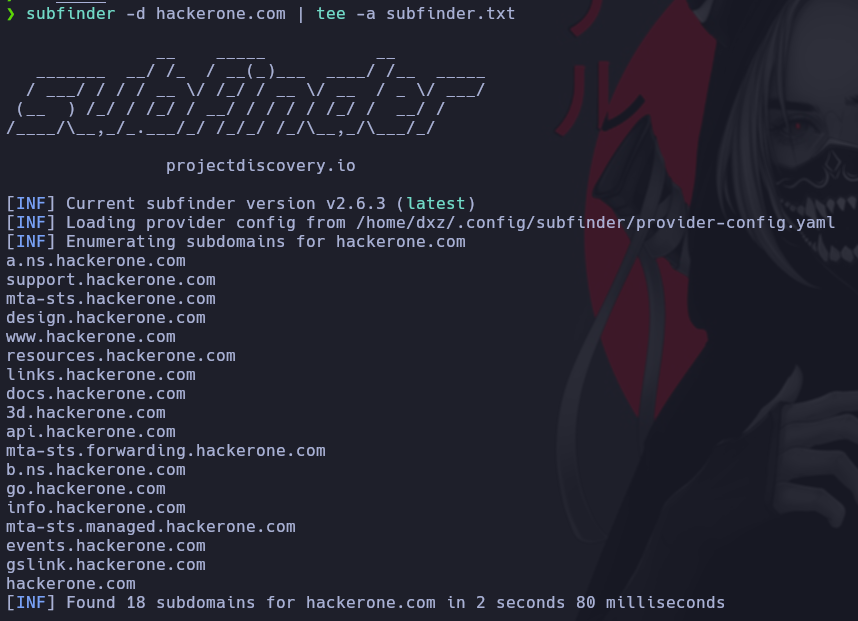
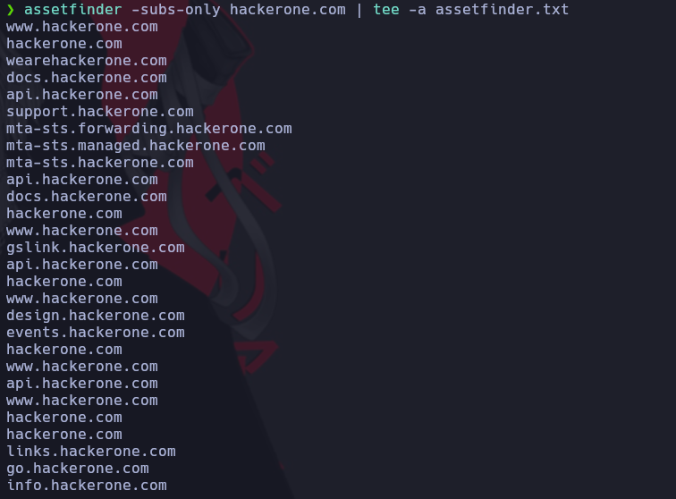
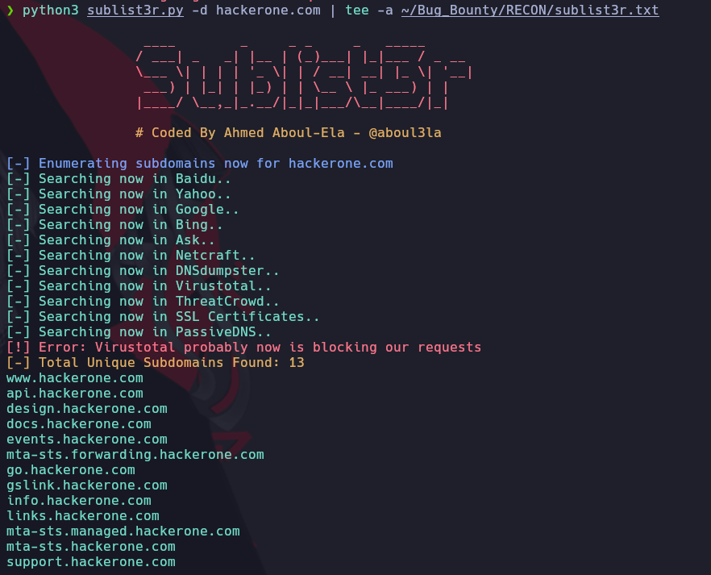
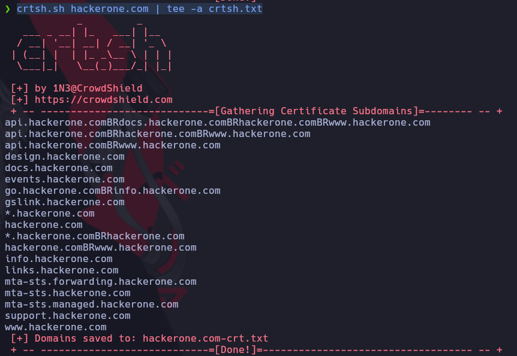

# Enumeración de Subdominios

Herramientas a instalar.

## [Httpx](https://github.com/projectdiscovery/httpx)

Descargamos el binario y lo pegamos en la ruta

```ruby
unzip httpx_1.3.7_linux_amd64.zip
sudo mv httpx /usr/local/bin
```

```ruby
cat all_domains.txt | httpx -sc -title -cl -t 100 -o Subdominios_Vivos.txt
```

## [Subfinder](https://github.com/projectdiscovery/subfinder)

Descargamos el binario y lo descomprimimos y lo pegamos el la ruta.

```ruby
unzip subfinder_2.6.3_linux_amd64.zip
sudo cp subfinder /usr/bin
```

Corremos la herramienta:

```ruby
subfinder -d hackerone.com -o subfinder.txt
```




## [Amass](https://github.com/owasp-amass/amass)

[VIDEO Demostrativo](https://www.youtube.com/watch?v=rP7dcYRATnY&ab_channel=BePractical)

DEBEMOS configurar las APIS
Descargamos el binario y lo descomprimimos y lo pegamos en la ruta.

```ruby
unzip amass_Linux_amd64.zip
mv amass_Linux_amd64/amass /usr/local/bin/
```

Para enumerar subdominio

```ruby
amass intel -d hackerone.com -whois -v
```

Para filtrar el archivo

```
cat amass.txt | awk '{print $1}' | sort -u
```

## [Assetfinder](https://github.com/tomnomnom/assetfinder)

Hacemos un git clone del repositorio

```ruby
git clone https://github.com/tomnomnom/assetfinder.git
cd assetfinder
go mod init assetfinder
go build .
sudo mv assetfinder /usr/local/bin
```

Para usar el programa usamos la siguiente linea de comandos

```ruby
assetfinder -subs-only hackerone.com | tee -a assetfinder.txt
```




## [Sublist3r](https://github.com/aboul3la/Sublist3r)

```ruby
cd /opt
git clone https://github.com/aboul3la/Sublist3r.git
cd Sublist3r
sudo pip install -r requirements.txt
```

Si da error despues de instalar python ejecutamos el siguiente comando

```ruby
sudo rm /usr/lib/python3.11/EXTERNALLY-MANAGED
```

Lo dejamos en la carpeta /opt y para correr el programa usamos. Pegamos el archivo de salida en los demas

```ruby
sudo python3 sublist3r.py -d hackerone.com -o sublist3r.txt
```



## [CRT.SH](https://gist.github.com/1N3/dec432d14fec84e09733f39669ebca0f)

[Link Udemy](https://www.udemy.com/course/recon-for-bug-bounty-pentesting-ethicalhacking-by-shifa-rohit-hacktify/learn/lecture/21288364#questions)

Creamos un archivo llamado crtsh.sh y pegamos todo el codigo.

```ruby
cd /usr/local/bin
sudo nano crtsh.sh
sudo chmod +x crtsh.sh
```

Para ejecutar el programa usamo3.

```ruby
crtsh.sh hackerone.com 
```



## [Shodomain](https://github.com/SmoZy92/Shodomain)

[Link Udemy](https://www.udemy.com/course/recon-for-bug-bounty-pentesting-ethicalhacking-by-shifa-rohit-hacktify/learn/lecture/21288372#questions)

Clonamos el proyecto en la carpeta  y ejecutamos el programa de la siguiente manera.\
Necesitamos una API KEY con creditos

```ruby
python3 shodomain.py [API KEY] hackerone.com
```

## [Censys](https://github.com/gelim/censys)

[Link Udemy Video](https://www.udemy.com/course/recon-for-bug-bounty-pentesting-ethicalhacking-by-shifa-rohit-hacktify/learn/lecture/21288380#questions)

## [Facebook Certificate Transparency]()

[Link Udemy](https://www.udemy.com/course/recon-for-bug-bounty-pentesting-ethicalhacking-by-shifa-rohit-hacktify/learn/lecture/21288388#questions)

## [Google Certificate Transparency]()  

[Link Udemy](https://www.udemy.com/course/recon-for-bug-bounty-pentesting-ethicalhacking-by-shifa-rohit-hacktify/learn/lecture/21288394#questions)


## WEB [Subdomain Finder](https://pentest-tools.com/information-gathering/find-subdomains-of-domain)

[Link Udemy](https://www.udemy.com/course/recon-for-bug-bounty-pentesting-ethicalhacking-by-shifa-rohit-hacktify/learn/lecture/21362498#questions)

## WEB [Chaos.projectdiscovery.io](https://chaos.projectdiscovery.io/)

[Link Udeny](https://www.udemy.com/course/recon-for-bug-bounty-pentesting-ethicalhacking-by-shifa-rohit-hacktify/learn/lecture/21524496#questions)

## WEB [Nmmaper](https://www.nmmapper.com/)

[Link Udemy](https://www.udemy.com/course/recon-for-bug-bounty-pentesting-ethicalhacking-by-shifa-rohit-hacktify/learn/lecture/21364498#questions)

## WEB [VirusTotal](https://www.virustotal.com/gui/home/search)

Realizamos la busqueda y vamos a la pestaña RELATIONS

[Link Udemy](https://www.udemy.com/course/recon-for-bug-bounty-pentesting-ethicalhacking-by-shifa-rohit-hacktify/learn/lecture/21362500#questions)

## WEB [Cencys](https://search.censys.io/#)

[Link Udemy](https://www.udemy.com/course/recon-for-bug-bounty-penetration-testers-ethical-hackers/learn/lecture/35439270#overview)

# Filtrar TODOS los dominios encontrados

[Link Udemy](https://www.udemy.com/course/recon-for-bug-bounty-penetration-testers-ethical-hackers/learn/lecture/35438808#overview)
