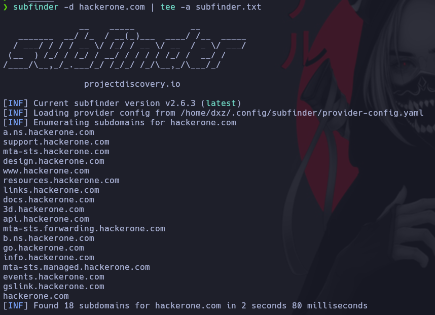
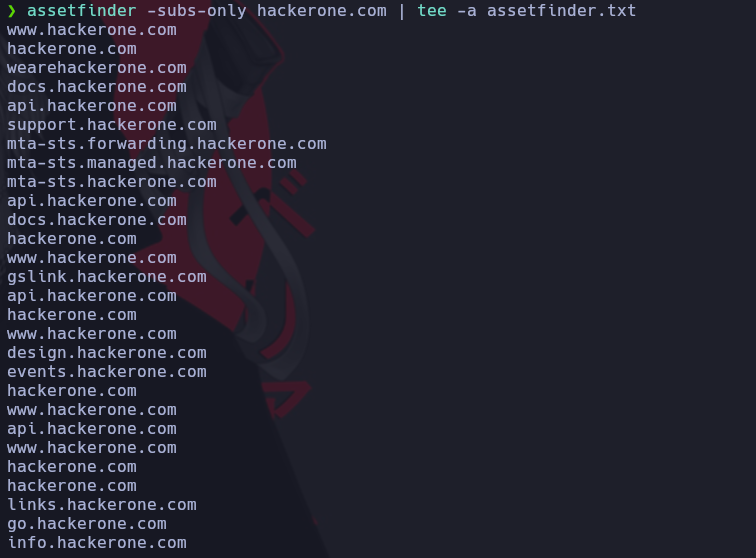
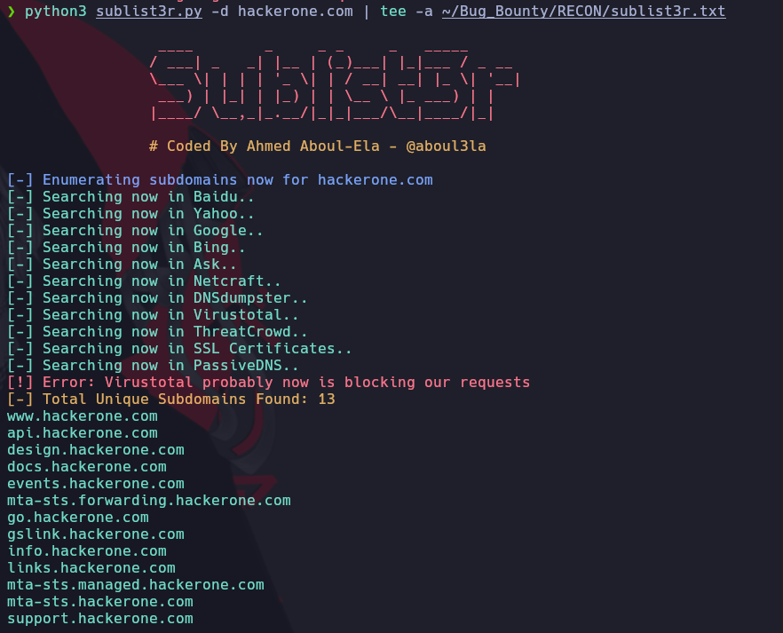

# Enumeración de Subdominios

Herramientas a instalar.

## [Httpx](https://github.com/projectdiscovery/httpx)

Descargamos el binario y lo pegamos en la ruta

```ruby
unzip httpx_1.3.7_linux_amd64.zip
sudo mv httpx /usr/local/bin
```

## [Subfinder](https://github.com/projectdiscovery/subfinder)

Descargamos el binario y lo descomprimimos y lo pegamos el la ruta.

```ruby
unzip subfinder_2.6.3_linux_amd64.zip
sudo cp subfinder /usr/bin
```

Corremos la herramienta:

```ruby
subfinder -d hackerone.com | tee -a subfinder.txt
```




## [Amass](https://github.com/owasp-amass/amass)

Descargamos el binario y lo descomprimimos y lo pegamos en la ruta.

```ruby
unzip amass_Linux_amd64.zip
mv amass_Linux_amd64/amass /usr/local/bin/
```

## [Assetfinder](https://github.com/tomnomnom/assetfinder)

Hacemos un git clone del repositorio

```ruby
git clone https://github.com/tomnomnom/assetfinder.git
cd assetfinder
go mod init assetfinder
go build .
sudo mv assetfinder /usr/local/bin
```

Para usar el programa usamos la siguiente linea de comandos

```ruby
assetfinder -subs-only hackerone.com | tee -a assetfinder.txt
```




## [Sublist3r](https://github.com/aboul3la/Sublist3r)

```ruby
cd /opt
git clone https://github.com/aboul3la/Sublist3r.git
cd Sublist3r
sudo pip install -r requirements.txt
```

Lo dejamos en la carpeta /opt y para correr el programa usamos

```ruby
 python3 sublist3r.py -d hackerone.com | tee -a ~/Bug_Bounty/RECON/sublist3r.txt
```



## [CRT.SH](https://gist.github.com/1N3/dec432d14fec84e09733f39669ebca0f)

Creamos un archivo llamado crtsh.sh y pegamos todo el codigo.

```ruby
cd /usr/local/bin
sudo nano crtsh.sh
sudo chmod +x crtsh.sh
```

Para ejecutar el programa usamos.

```ruby
crtsh.sh hackerone.com | tee -a crtsh.txt
```


